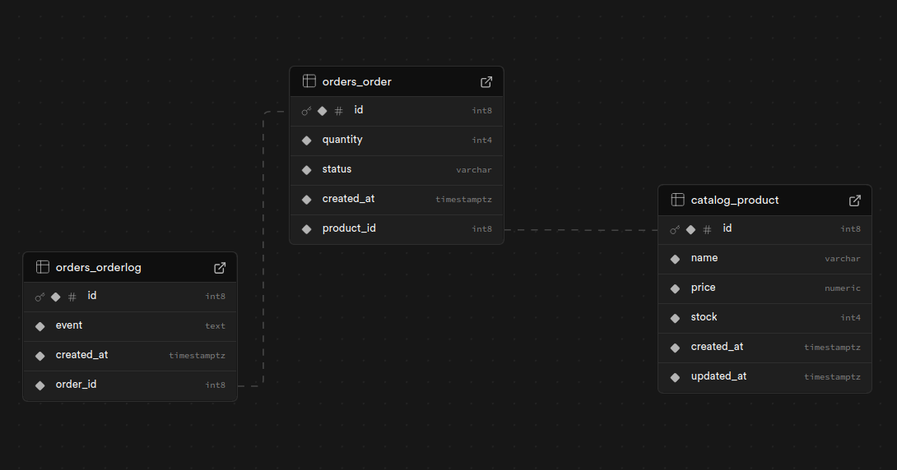

# Distributed E-Commerce Order System

[](https://www.python.org/)
[](https://www.djangoproject.com/)
[](https://docs.celeryq.dev/)
[](https://www.postgresql.org/)
[](https://redis.io/)
[](http://34.101.175.6:8000/api/docs/)
[](https://cloud.google.com/compute)

Production-ready backend that simulates a distributed e-commerce platform. It guarantees stock consistency under heavy concurrency, offloads order processing to Celery workers, and exposes a fully documented OpenAPI surface.

## Features

- Product CRUD with Redis-backed detail caching (automatic invalidation on write operations).
- Purchase endpoint that prevents race conditions through atomic SQL updates.
- Celery worker (Redis broker) executing a 5-second fake external call and logging "Order #ID Processed." when complete.
- Detailed Swagger UI (success + error responses) deployed at [34.101.175.6:8000/api/docs/](http://34.101.175.6:8000/api/docs/).
- Containerised stack (API, worker, PostgreSQL, Redis) with Docker Compose and GCP Compute Engine deployment notes.

## End-to-End Flow

1. **Client hits `/api/orders/` (POST)** with `product_id` and `quantity`.
2. **Atomic stock decrement** in `purchase_product` service:
	```sql
	UPDATE catalog_product
	SET stock = stock - %(quantity)s
	WHERE id = %(product_id)s AND stock >= %(quantity)s;
	```
	- `UPDATE` succeeds for exactly one transaction because PostgreSQL locks the matched row and checks the `stock >= quantity` predicate.
	- Concurrent buyers for the last item: the first transaction wins; others see `updated_rows == 0` and receive a 409 `Out of stock` response.
3. **Order creation** happens in the same transaction: status `pending` + `OrderLog` entry `"Order created"`.
4. **Celery task enqueued** (`process_order.delay(order.id)`). The worker runs a two-phase transaction:
	- Lock order row with `SELECT ... FOR UPDATE` and mark `processing`.
	- Sleep 5 seconds (simulate external API) then mark `completed` and append log `"Order #ID Processed."`.
	- Task is idempotent (exit early if order already completed/cancelled).
5. **Redis cache** stores `/api/products/{id}/` responses keyed with `catalog:product:{id}:detail:v1`. Cache is deleted on product update/delete to keep data fresh.
6. **Deployment**: Docker Compose runs the API and worker on GCP Compute Engine; `.env` supplies Supabase/Redis Cloud URLs so no secrets are baked into images.

## Database Schema



**Products**
- `id`: serial primary key
- `name`: varchar(200)
- `price`: decimal(12, 2)
- `stock`: positive integer
- `created_at`, `updated_at`: timestamp

**Orders**
- `id`: serial primary key
- `product_id`: FK → Products (PROTECT on delete)
- `quantity`: positive integer
- `status`: `pending | processing | completed | cancelled`
- `created_at`: timestamp

**Order Logs**
- `id`: serial primary key
- `order_id`: FK → Orders (CASCADE on delete)
- `event`: text
- `created_at`: timestamp

## API Surface

| Method | Endpoint | Description |
|--------|----------|-------------|
| GET | `/api/products/` | Paginated products list |
| POST | `/api/products/` | Create a product |
| GET | `/api/products/{id}/` | Product detail (served from Redis cache) |
| PUT / PATCH / DELETE | `/api/products/{id}/` | Update or remove a product |
| GET | `/api/orders/` | Orders list (without logs) |
| GET | `/api/orders/{id}/` | Order detail with logs |
| POST | `/api/orders/` | Create order & enqueue Celery task |

Full request/response samples (201, 404, 409, 422, etc.) are documented in [Swagger UI](http://34.101.175.6:8000/api/docs/).

## Local Development

```bash
# Clone repository
git clone https://github.com/yoockh/distributed-ecommerce-order-system.git
cd distributed-ecommerce-order-system

# Virtual environment
python3 -m venv .venv
source .venv/bin/activate

# Dependencies
pip install --upgrade pip
pip install -r requirements.txt

# Environment variables
cp .env.example .env
# edit .env with Supabase DATABASE_URL, Redis URLs, Celery backend, cache TTL, etc.

# Run migrations
python manage.py migrate

# Start API
python manage.py runserver 0.0.0.0:8000

# Start Celery worker (new terminal)
celery -A config worker -l info
```

## Docker Compose

```bash
docker compose up --build
```

Exposed services:

- API: `http://localhost:8000`
- Swagger: `http://localhost:8000/api/docs/`
- PostgreSQL: `localhost:5432`
- Redis: `localhost:6379`

To use managed Supabase/Redis instead of local containers, remove the `db`/`redis` services and point `.env` to the managed URLs.

## Deployment on Google Compute Engine

1. Upload project folder and `.env` to the VM (e.g., `gcloud compute scp`).
2. Install Docker & Docker Compose plugin (`sudo apt-get install docker.io docker-compose-plugin`).
3. Run `docker compose up --build -d`.
4. Open port 8000 (or place Nginx / Cloud Load Balancer in front for HTTPS).
5. Public Swagger docs at [http://34.101.175.6:8000/api/docs/](http://34.101.175.6:8000/api/docs/).
6. Celery worker starts automatically via `worker` service; background tasks hit Redis Cloud per `.env` configuration.

## Testing

```bash
python manage.py test apps.orders
```

Tests cover the purchase service (stock decrement, task enqueue, out-of-stock and product-not-found scenarios). Add more test modules under `apps/catalog/tests.py` and `apps/orders/tests.py` as needed.

## Author

- Aisiya Qutwatunnada
- yaya45chan@gmail.com

---

Pull requests and issues are welcome.